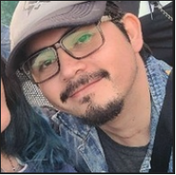
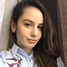
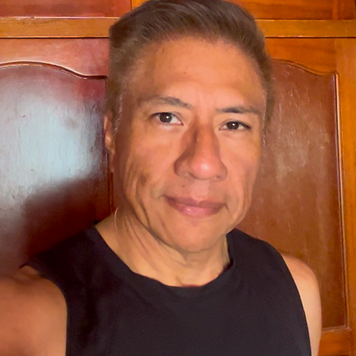
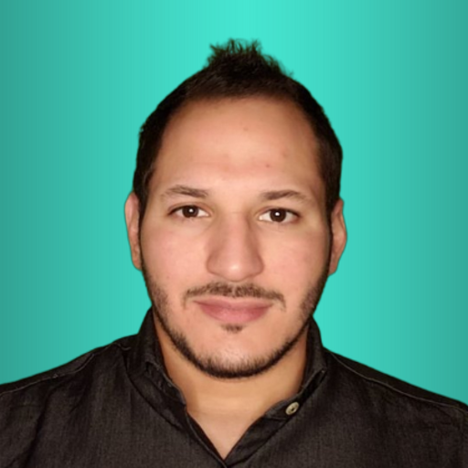
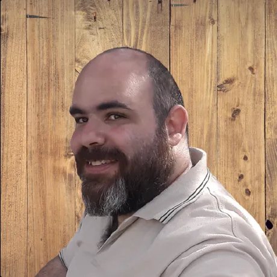
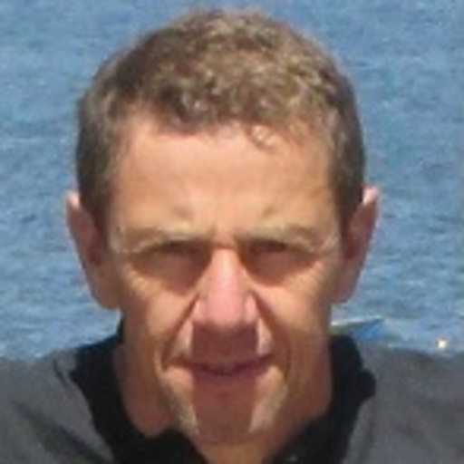
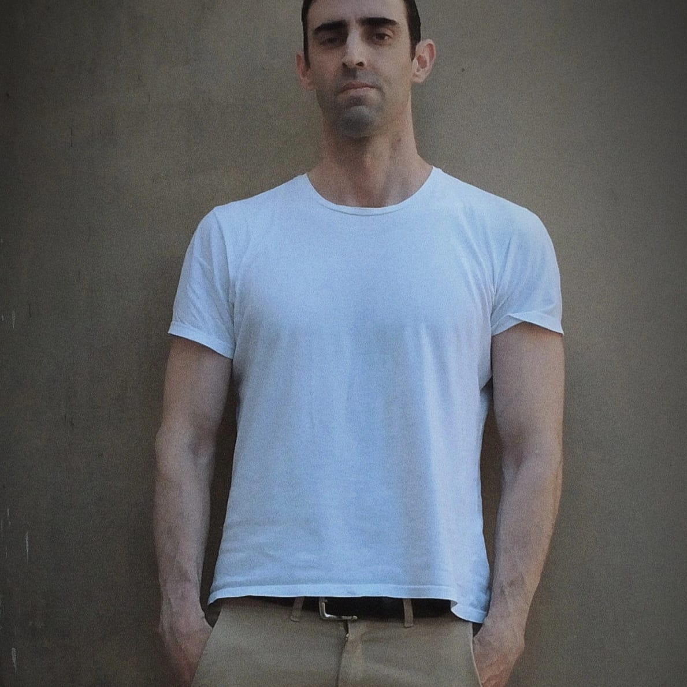

# equipo-h3-11-openlab
Propuesta de aplicación de participación en DAOs para OpenLab, dentro del marco del Hackathon de No Country.

 Web de desarrollo: 

## Badges

## Equipo de desarrollo H3-11-OpenLab

## Team Lider

### - _Jose Contreras_

## Diseño UI/UX

#### - _Paula Sancho_

## Frontend

#### - _Antonio Villacrés_

## Backend & Frontend

#### - _Matias Acevedo_

#### - _Anibal Elbaum_

## QA

#### - _Ricardo David Minhot_

## Project Manager

#### - _Damian Berrojalvis_

